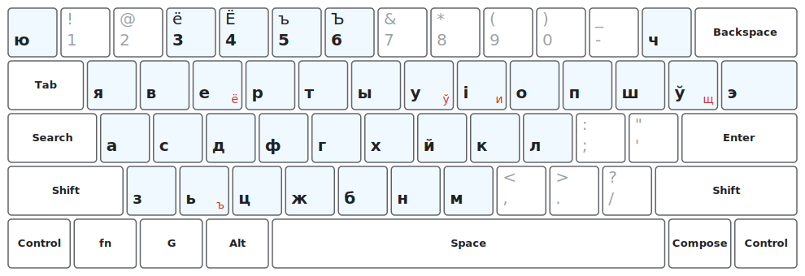

=== Belarusian phonetic keyboard layout as a ChromeOS extension

This extension implements the following keyboard layout (aka
"yawerty", just adapted for Belarusian).

It is more or less a "port" of `be(phonetic)` from recent XKB. Sadly,
ChromeOS still comes with too old version of XKB, so we need to
reimplement the layout as a JavaScript ChromeOS Input Method
Extension.

This layout also uses "compose" key (right alt) to simplify access to
some characters, including some characters not used in Belarusian
language. The picture above shows those extra characters in red
color. Note, however, that ChromeOS intercepts some of those right-alt
combinations.
