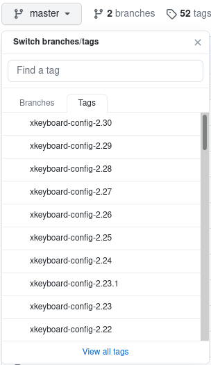

# Example Extension

## Creating a New Layout

If you desire to use your favorite keyboard layout but it is not available by
default in Chrome OS or in this repository then a new extension will need to be
created. In this directory you can find some examples to use as a template for
creating your own. Please feel free to submit a pull request to share your
extension with the world.

### Preparation

The first thing to do is determine if you can take the simple route or if your
extension will require more effort. If your layout is already in the version of
[xkeyboard-config](https://github.com/freedesktop/xkeyboard-config) that is
available in Chrome OS you are nearly ready.

On your Chrome OS device, open a new browser tab and go to `chrome://version`.
Find both the "Google Chrome" and the "Platform" version numbers. My device, as
I write this, is "Google Chrome" **85**.0.4183.84 and "Platform" **13310**.59.0.

Navigate to the [Chromium source
repository](https://chromium.googlesource.com/chromiumos/overlays/chromiumos-overlay/+refs).
Click on the branch named 'release-R<chrome version>-<platform version>.B', e.g.
[release-R**85**-**13310**.B](https://chromium.googlesource.com/chromiumos/overlays/chromiumos-overlay/+/refs/heads/release-R85-13310.B).
Click the 'x11-misc' and then 'xkeyboard-config' links. You will now need to
compare the version number listed for the xkeyboard-config ebuild file. The
revision I am using for this example is 2.27.

Going back to the
[xkeyboard-config](https://github.com/freedesktop/xkeyboard-config) repository
and update the source viewer to the tag based on that release version. In GitHub
you click the branch selection menu, click "Tags", and then select the
appropriate version.

Now browse down to the 'symbols' directory and look for the country code
appropriate for your layout. Search the file you select for the layout name. For
example, search 'dvorak'.

### XKB

If the layout exists in the version of xkeyboard-config that is running on your
build of Chrome OS you can easily create a new extension with just an extension
manifest file. Head over to the [XKB](xkb/README.md) section for details on how
to proceed.

### Remapping

If, however, the layout does not exist then you have a few options to consider.
If the layout exists in a version of xkeyboard-config that is newer than that
running on Chrome OS then you could [create a
bug](https://chromium.googlesource.com/chromiumos/docs/+/master/reporting_bugs.md)
requesting a new version of xkeyboard-config be built and included. This may
take a while.

The other option is to create your own extension using some sort of key
combination mapping in JavaScript. Head over to the [remap](remap/README.md)
section for details on how to proceed.
